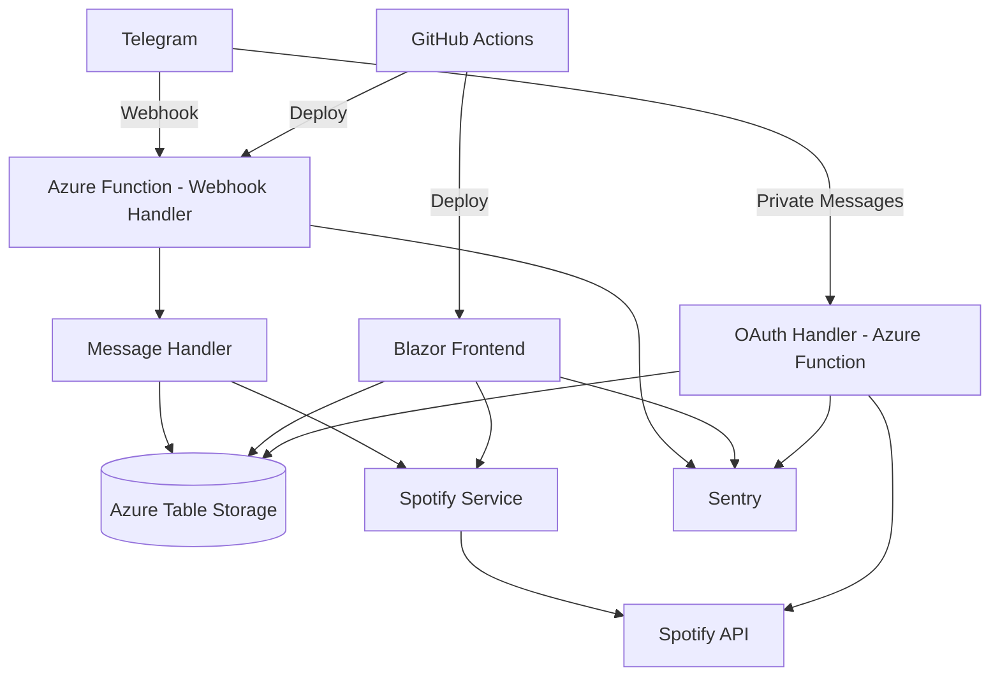

# Design Document: Telegram Spotify Bot

## Overview

This document describes the technical design for a .NET-based Telegram bot that automatically detects Spotify track URLs in group chats and adds them to configured playlists. The system includes a collaborative voting mechanism, automatic track removal based on downvotes, and a Blazor web frontend for browsing playlist history.

The application follows a stateless, webhook-driven architecture where all state is persisted in a database. This enables horizontal scaling and ensures reliability across deployments.

### Key Technologies

- **.NET 10**: Core application framework
- **Azure Functions**: Serverless hosting for webhook handlers
- **Azure Table Storage**: Ultra-low-cost NoSQL storage for all data
- **Telegram.Bot**: NuGet package for Telegram Bot API integration
- **SpotifyAPI.Web**: NuGet package for Spotify Web API integration
- **Blazor Server/WebAssembly**: Web frontend framework
- **Sentry**: Error logging and monitoring
- **GitHub Actions**: CI/CD pipeline for Azure deployment

## Architecture

### High-Level Architecture



### Component Overview

1. **Webhook Handler (Azure Function)**: HTTP-triggered function that receives Telegram updates
2. **Message Handler**: Processes messages, detects URLs, coordinates actions
3. **Spotify Service**: Manages Spotify API interactions (authentication, playlist operations, queue management)
4. **Table Storage Repository Layer**: Abstracts Azure Table Storage operations with repository pattern
5. **OAuth Handler (Azure Function)**: HTTP-triggered function managing Spotify OAuth flow
6. **Web Frontend**: Blazor application for browsing playlists and analytics
7. **Vote Manager**: Handles voting logic and automatic track removal
8. **Sentry Integration**: Error logging and monitoring across all components
9. **User Merge Service**: Administrative tool for merging duplicate user accounts

### Stateless Design

The application maintains no in-memory state between requests. Each webhook request:
1. Retrieves necessary configuration from Table Storage
2. Processes the message
3. Persists any state changes to Table Storage
4. Returns a response

This design enables:
- Horizontal scaling across multiple instances
- Zero-downtime deployments
- Resilience to application restarts
- Minimal cost with Azure Functions consumption plan

## Components and Interfaces

### 1. Webhook Handler (Azure Function)

**Responsibility**: Receive and validate Telegram webhook requests

```csharp
public class TelegramWebhookFunction
{
    private readonly IMessageHandler _messageHandler;
    private readonly ISentryClient _sentryClient;
    private readonly ILogger<TelegramWebhookFunction> _logger;
    
    [FunctionName("TelegramWebhook")]
    public async Task<IActionResult> Run(
        [HttpTrigger(AuthorizationLevel.Function, "post", Route = "webhook/telegram")] HttpRequest req)
    {
        // Validate webhook signature
        // Parse Telegram update
        // Route to appropriate handler based on update type
        // Log errors to Sentry
        // Return 200 OK within 5 seconds
    }
}
```

**Key Operations**:
- Validate incoming webhook requests
- Route updates to appropriate handlers (messages, reactions, callbacks)
- Handle errors gracefully and return appropriate HTTP status codes
- Log all errors to Sentry with context
- Detect and log Telegram ID changes to Sentry

### 2. Message Handler

**Responsibility**: Process incoming messages and coordinate bot actions

```csharp
public interface IMessageHandler
{
    Task HandleMessageAsync(Message message, CancellationToken cancellationToken);
    Task HandleCallbackQueryAsync(CallbackQuery callback, CancellationToken cancellationToken);
    Task HandleMessageReactionAsync(MessageReactionUpdated reaction, CancellationToken cancellationToken);
    Task HandleBotAddedToGroupAsync(ChatMemberUpdated update, CancellationToken cancellationToken);
}

public class MessageHandler : IMessageHandler
{
    private readonly ISpotifyUrlDetector _urlDetector;
    private readonly IConfigurationRepository _configRepo;
    private readonly ISpotifyService _spotifyService;
    private readonly ITrackRepository _trackRepo;
    private readonly IUserRepository _userRepo;
    private readonly ITelegramBotClient _botClient;
    private readonly ISentryClient _sentryClient;
    
    public async Task HandleMessageAsync(Message message, CancellationToken cancellationToken)
    {
        // Ensure user exists in database
        // Check if message is a bot command
        // Detect Spotify URLs in message text
        // Retrieve group configuration
        // Process track addition if configured
        // Handle duplicate detection
        // Send confirmation with voting options
    }
    
    public async Task HandleBotAddedToGroupAsync(ChatMemberUpdated update, CancellationToken cancellationToken)
    {
        // Create group chat record in database
        // Set administrator to user who added the bot
        // Send welcome message
    }
}
```

**Key Operations**:
- Detect Spotify track URLs using regex patterns
- Ensure users and group chats exist in database before processing
- Retrieve group chat configuration from database
- Coordinate with Spotify service for track operations
- Send replies with voting mechanisms (reactions or buttons)
- Handle bot commands (/auth, /configure, /sync, etc.)
- Log Telegram ID changes to Sentry

### 3. Spotify URL Detector

**Responsibility**: Extract Spotify track identifiers from message text

```csharp
public interface ISpotifyUrlDetector
{
    IEnumerable<string> DetectTrackUrls(string messageText);
    string ExtractTrackId(string spotifyUrl);
}

public class SpotifyUrlDetector : ISpotifyUrlDetector
{
    // Regex pattern for Spotify URLs supporting both open.spotify.com and play.spotify.com
    // Also supports spotify: URI format
    private static readonly Regex TrackUrlPattern = 
        new Regex(@"(https?://(open|play)\.spotify\.com/track/|spotify:track:)([\w\d]+)");
}
```

### 4. Spotify Service

**Responsibility**: Manage all Spotify API interactions

```csharp
public interface ISpotifyService
{
    Task<FullTrack> GetTrackAsync(string trackId, CancellationToken cancellationToken);
    Task<bool> AddTrackToPlaylistAsync(string playlistId, string trackId, string accessToken, CancellationToken cancellationToken);
    Task<bool> RemoveTrackFromPlaylistAsync(string playlistId, string trackId, string accessToken, CancellationToken cancellationToken);
    Task<bool> AddTrackToQueueAsync(string trackId, string accessToken, CancellationToken cancellationToken);
    Task<bool> IsUserPlayingAsync(string accessToken, CancellationToken cancellationToken);
    Task<string> RefreshAccessTokenAsync(string refreshToken, CancellationToken cancellationToken);
}

public class SpotifyService : ISpotifyService
{
    private readonly ISpotifyClientFactory _clientFactory;
    private readonly ILogger<SpotifyService> _logger;
    
    // Uses SpotifyAPI.Web library
    // Handles token refresh automatically
    // Implements retry logic for transient failures
}
```

**Key Operations**:
- Retrieve track metadata (name, artist, album, genres)
- Add/remove tracks from playlists
- Add tracks to user queues
- Check if user is currently playing music
- Refresh expired access tokens using refresh tokens

### 5. OAuth Handler (Azure Function)

**Responsibility**: Manage Spotify OAuth authentication flow

```csharp
public class SpotifyOAuthFunction
{
    private readonly IUserRepository _userRepo;
    private readonly ITelegramBotClient _botClient;
    private readonly ISentryClient _sentryClient;
    
    [FunctionName("SpotifyOAuthStart")]
    public IActionResult StartAuth(
        [HttpTrigger(AuthorizationLevel.Function, "get", Route = "auth/spotify/start")] HttpRequest req,
        [FromQuery] long telegramUserId,
        [FromQuery] long chatId)
    {
        // Generate OAuth state parameter
        // Store state with user ID in cache/database
        // Redirect to Spotify authorization URL
    }
    
    [FunctionName("SpotifyOAuthCallback")]
    public async Task<IActionResult> HandleCallback(
        [HttpTrigger(AuthorizationLevel.Function, "get", Route = "auth/spotify/callback")] HttpRequest req,
        [FromQuery] string code,
        [FromQuery] string state)
    {
        // Validate state parameter
        // Exchange code for access token and refresh token
        // Store credentials with scope in database
        // Send confirmation to user via Telegram private message
        // Log errors to Sentry
    }
}
```

**Key Operations**:
- Initiate OAuth flow with proper scopes
- Handle OAuth callbacks securely
- Store encrypted credentials with scope and expiration in database
- Send authentication links only in private chats
- Support both administrator and regular user authentication
- Log errors to Sentry

### 6. Configuration Repository

**Responsibility**: Manage group chat and user configuration

```csharp
public interface IConfigurationRepository
{
    Task<GroupChat> GetGroupChatAsync(long telegramChatId, CancellationToken cancellationToken);
    Task<GroupChat> CreateGroupChatAsync(long telegramChatId, long administratorTelegramUserId, CancellationToken cancellationToken);
    Task SaveGroupConfigAsync(GroupChat groupChat, CancellationToken cancellationToken);
    Task<UserGroupConfig> GetUserConfigAsync(long telegramUserId, long telegramChatId, CancellationToken cancellationToken);
    Task SaveUserConfigAsync(UserGroupConfig config, CancellationToken cancellationToken);
    Task<bool> IsPlaylistLinkedAsync(string playlistId, CancellationToken cancellationToken);
}

public class GroupChat
{
    public long TelegramChatId { get; set; } // Primary Key
    public long AdministratorTelegramUserId { get; set; }
    public string PlaylistId { get; set; }
    public string PlaylistName { get; set; } // Cached from Spotify to avoid API calls
    public int DownvoteThreshold { get; set; } = 3;
    public DateTime CreatedAt { get; set; }
    
    public User Administrator { get; set; }
    public ICollection<TrackRecord> TrackRecords { get; set; }
    public ICollection<GroupChatMember> Members { get; set; }
}

public class GroupChatMember
{
    public long TelegramChatId { get; set; }
    public long TelegramUserId { get; set; }
    public DateTime JoinedAt { get; set; }
    
    public GroupChat GroupChat { get; set; }
    public User User { get; set; }
}

public class UserGroupConfig
{
    public long Id { get; set; }
    public long TelegramUserId { get; set; }
    public long TelegramChatId { get; set; }
    public bool AutoQueueEnabled { get; set; } = false; // Opt-in, false by default
    
    public User User { get; set; }
    public GroupChat GroupChat { get; set; }
}
```

**Key Operations**:
- Ensure playlist can only be linked to one group chat (uniqueness constraint)
- Cache playlist name to avoid Spotify API calls in frontend
- Track group chat members for efficient frontend queries
- Default AutoQueueEnabled to false (opt-in)

### 7. Track Repository

**Responsibility**: Manage track records and metadata

```csharp
public interface ITrackRepository
{
    Task<Track> GetOrCreateTrackAsync(string spotifyId, CancellationToken cancellationToken);
    Task<TrackRecord> CreateTrackRecordAsync(TrackRecord record, CancellationToken cancellationToken);
    Task<TrackRecord> GetTrackRecordAsync(long chatId, string spotifyTrackId, CancellationToken cancellationToken);
    Task<bool> IsTrackDeletedAsync(long chatId, string spotifyTrackId, CancellationToken cancellationToken);
    Task MarkTrackAsDeletedAsync(long trackRecordId, CancellationToken cancellationToken);
}
```

### 8. Vote Manager

**Responsibility**: Handle voting logic and track removal

```csharp
public interface IVoteManager
{
    Task RecordVoteAsync(long trackRecordId, long userId, VoteType voteType, CancellationToken cancellationToken);
    Task RemoveVoteAsync(long trackRecordId, long userId, CancellationToken cancellationToken);
    Task<VoteCounts> GetVoteCountsAsync(long trackRecordId, CancellationToken cancellationToken);
    Task<bool> ShouldRemoveTrackAsync(long trackRecordId, int threshold, CancellationToken cancellationToken);
}

public class VoteManager : IVoteManager
{
    private readonly IVoteRepository _voteRepo;
    private readonly ITrackRepository _trackRepo;
    private readonly ISpotifyService _spotifyService;
    private readonly IConfigurationRepository _configRepo;
    
    public async Task RecordVoteAsync(long trackRecordId, long userId, VoteType voteType, CancellationToken cancellationToken)
    {
        // Check if user already voted
        // Update or create vote record
        // Get updated vote counts
        // Check if track should be removed
        // If yes, remove from playlist and mark as deleted
    }
}
```

### 9. Chat History Sync Service

**Responsibility**: Process historical messages to add past tracks

```csharp
public interface IChatHistorySyncService
{
    Task SyncFromTelegramHistoryAsync(long chatId, CancellationToken cancellationToken);
    Task SyncFromExportedJsonAsync(long chatId, string jsonContent, CancellationToken cancellationToken);
}

public class ChatHistorySyncService : IChatHistorySyncService
{
    private readonly ITelegramBotClient _botClient;
    private readonly IMessageHandler _messageHandler;
    private readonly ISpotifyUrlDetector _urlDetector;
    
    // Process messages in chronological order
    // Create track records with original timestamps
    // Skip duplicates and deleted tracks
    // Return summary of added tracks
}
```

### 10. Blazor Web Frontend

**Responsibility**: Provide web interface for browsing playlists and user analytics

**Pages**:
- **Playlist List**: Display all available playlists with track counts
- **Playlist Detail**: Show tracks with metadata, votes, and contributors (paginated)
- **User List**: Display all users with contribution statistics
- **User Detail**: Show user's tracks, voting activity, and per-playlist statistics
- **User Filter**: Filter tracks by contributor
- **Genre Filter**: Filter tracks by genre

**Components**:
```csharp
// PlaylistList.razor
@page "/playlists"
// Display list of playlists with track counts

// PlaylistDetail.razor
@page "/playlist/{playlistId}"
// Display tracks with voting data (paginated)
// Show contributor list
// Show genre list
// Handle filtering
// Display user avatars from Telegram

// UserList.razor
@page "/users"
// Display all users with total upvotes/downvotes given and received

// UserDetail.razor
@page "/user/{telegramUserId}"
// Display user's Telegram avatar
// Show total upvotes/downvotes given (overall and per playlist)
// Show total upvotes/downvotes received on shared tracks (overall and per playlist)
// Show list of users who upvoted/downvoted their tracks
// Show tracks shared by user ordered by upvotes descending
// Show per-playlist statistics

// TrackCard.razor
// Display individual track with metadata
// Show who shared it and when
// Display vote counts
// Show list of users who upvoted/downvoted with their avatars
```

**Key Features**:
- Pagination for track lists (handle thousands of tracks efficiently)
- Display Telegram user avatars
- Show detailed voting information (who voted, vote counts)
- Per-playlist and overall statistics for users
- Efficient queries using GroupChatMember table

### 11. User Merge Service

**Responsibility**: Administrative tool for merging duplicate user accounts when Telegram IDs change

```csharp
public interface IUserMergeService
{
    Task MergeUsersAsync(long oldTelegramUserId, long newTelegramUserId, CancellationToken cancellationToken);
}

public class UserMergeService : IUserMergeService
{
    private readonly IUserRepository _userRepo;
    private readonly ITrackRepository _trackRepo;
    private readonly IVoteRepository _voteRepo;
    private readonly IConfigurationRepository _configRepo;
    private readonly ISentryClient _sentryClient;
    
    public async Task MergeUsersAsync(long oldTelegramUserId, long newTelegramUserId, CancellationToken cancellationToken)
    {
        // Update all TrackRecords to reference new user ID
        // Update all Votes to reference new user ID
        // Update all UserGroupConfigs to reference new user ID
        // Update all GroupChats where user is administrator
        // Update all GroupChatMembers to reference new user ID
        // Delete old user record
        // Log merge operation to Sentry
    }
}
```

**Key Operations**:
- Replace all references to old user ID with new user ID across all tables
- Maintain data integrity during merge
- Log merge operations for audit trail
- Provide admin interface for manual merges

## Data Models

### Azure Table Storage Schema

Azure Table Storage is a NoSQL key-value store that uses PartitionKey and RowKey for indexing. The schema is designed to optimize for common query patterns while minimizing cost.

**Key Design Decisions**:
- Use meaningful PartitionKey values to enable efficient queries
- RowKey provides uniqueness within a partition
- Denormalize data where necessary to avoid expensive cross-partition queries
- Store related entities in the same partition when queried together
- Use separate tables for different entity types

### Table Structure

**Tables**:
1. **GroupChats**: Group chat configurations
2. **Users**: User authentication and profile data
3. **UserGroupConfigs**: Per-user, per-group settings
4. **Tracks**: Spotify track metadata (normalized)
5. **Artists**: Spotify artist metadata (normalized)
6. **Albums**: Spotify album metadata (normalized)
7. **Genres**: Genre metadata
8. **TrackGenres**: Many-to-many relationship between tracks and genres
9. **TrackRecords**: Track sharing events in group chats
10. **Votes**: User votes on tracks
11. **GroupChatMembers**: Group membership for efficient queries

### Entity Definitions with Table Storage Keys

```csharp
// GroupChats Table
public class GroupChatEntity : ITableEntity
{
    public string PartitionKey { get; set; } // "GROUPCHAT"
    public string RowKey { get; set; } // TelegramChatId as string
    public string AdministratorTelegramUserId { get; set; }
    public string PlaylistId { get; set; }
    public string PlaylistName { get; set; }
    public int DownvoteThreshold { get; set; } = 3;
    public DateTime CreatedAt { get; set; }
    public DateTimeOffset? Timestamp { get; set; }
    public ETag ETag { get; set; }
}

// Users Table
public class UserEntity : ITableEntity
{
    public string PartitionKey { get; set; } // "USER"
    public string RowKey { get; set; } // TelegramUserId as string
    public string EncryptedAccessToken { get; set; }
    public string EncryptedRefreshToken { get; set; }
    public int? TokenExpiresIn { get; set; }
    public string Scope { get; set; }
    public string TelegramAvatarUrl { get; set; }
    public DateTime CreatedAt { get; set; }
    public DateTimeOffset? Timestamp { get; set; }
    public ETag ETag { get; set; }
}

// UserGroupConfigs Table
public class UserGroupConfigEntity : ITableEntity
{
    public string PartitionKey { get; set; } // TelegramChatId as string
    public string RowKey { get; set; } // TelegramUserId as string
    public bool AutoQueueEnabled { get; set; } = false;
    public DateTimeOffset? Timestamp { get; set; }
    public ETag ETag { get; set; }
}

// GroupChatMembers Table
public class GroupChatMemberEntity : ITableEntity
{
    public string PartitionKey { get; set; } // TelegramChatId as string
    public string RowKey { get; set; } // TelegramUserId as string
    public DateTime JoinedAt { get; set; }
    public DateTimeOffset? Timestamp { get; set; }
    public ETag ETag { get; set; }
}

// Tracks Table
public class TrackEntity : ITableEntity
{
    public string PartitionKey { get; set; } // "TRACK"
    public string RowKey { get; set; } // SpotifyId
    public string Name { get; set; }
    public int DurationSeconds { get; set; }
    public string PreviewUrl { get; set; }
    public string ArtistSpotifyId { get; set; }
    public string ArtistName { get; set; } // Denormalized for display
    public string AlbumSpotifyId { get; set; }
    public string AlbumName { get; set; } // Denormalized for display
    public string AlbumImageUrl { get; set; } // Denormalized for display
    public DateTime CreatedAt { get; set; }
    public DateTimeOffset? Timestamp { get; set; }
    public ETag ETag { get; set; }
}

// Artists Table
public class ArtistEntity : ITableEntity
{
    public string PartitionKey { get; set; } // "ARTIST"
    public string RowKey { get; set; } // SpotifyId
    public string Name { get; set; }
    public DateTimeOffset? Timestamp { get; set; }
    public ETag ETag { get; set; }
}

// Albums Table
public class AlbumEntity : ITableEntity
{
    public string PartitionKey { get; set; } // "ALBUM"
    public string RowKey { get; set; } // SpotifyId
    public string Name { get; set; }
    public string ImageUrl { get; set; }
    public DateTimeOffset? Timestamp { get; set; }
    public ETag ETag { get; set; }
}

// Genres Table
public class GenreEntity : ITableEntity
{
    public string PartitionKey { get; set; } // "GENRE"
    public string RowKey { get; set; } // Genre name
    public DateTimeOffset? Timestamp { get; set; }
    public ETag ETag { get; set; }
}

// TrackGenres Table (Many-to-many)
public class TrackGenreEntity : ITableEntity
{
    public string PartitionKey { get; set; } // TrackSpotifyId
    public string RowKey { get; set; } // GenreName
    public DateTimeOffset? Timestamp { get; set; }
    public ETag ETag { get; set; }
}

// TrackRecords Table
public class TrackRecordEntity : ITableEntity
{
    public string PartitionKey { get; set; } // TelegramChatId as string
    public string RowKey { get; set; } // Guid for uniqueness
    public string TrackSpotifyId { get; set; }
    public string TrackName { get; set; } // Denormalized for display
    public string ArtistName { get; set; } // Denormalized for display
    public string AlbumName { get; set; } // Denormalized for display
    public string AlbumImageUrl { get; set; } // Denormalized for display
    public long SharedByTelegramUserId { get; set; }
    public string SharedByUsername { get; set; } // Denormalized for display
    public string SharedByAvatarUrl { get; set; } // Denormalized for display
    public int TelegramMessageId { get; set; }
    public bool IsDeleted { get; set; }
    public bool IsDuplicate { get; set; }
    public DateTime SharedAt { get; set; }
    public int UpvoteCount { get; set; } // Denormalized for performance
    public int DownvoteCount { get; set; } // Denormalized for performance
    public DateTimeOffset? Timestamp { get; set; }
    public ETag ETag { get; set; }
}

// Votes Table
public class VoteEntity : ITableEntity
{
    public string PartitionKey { get; set; } // TrackRecordId (RowKey from TrackRecords)
    public string RowKey { get; set; } // TelegramUserId as string
    public string VoteType { get; set; } // "Upvote" or "Downvote"
    public string VoterUsername { get; set; } // Denormalized for display
    public string VoterAvatarUrl { get; set; } // Denormalized for display
    public DateTime CreatedAt { get; set; }
    public DateTime UpdatedAt { get; set; }
    public DateTimeOffset? Timestamp { get; set; }
    public ETag ETag { get; set; }
}
```

### Denormalization Strategy

To optimize for read performance and minimize cross-partition queries in Table Storage:

**Denormalized Fields**:
- Track names, artist names, album names, and images are duplicated in TrackRecordEntity
- Vote counts are stored in TrackRecordEntity and updated when votes change
- User display names and avatars are duplicated in TrackRecordEntity and VoteEntity
- Album information is duplicated in TrackEntity

**Benefits**:
- Single-partition queries for displaying playlist tracks
- No need to join across tables for common display scenarios
- Faster page loads in frontend
- Lower cost (fewer read operations)

**Trade-offs**:
- Slightly more complex write operations (update denormalized data)
- Potential for stale data if not updated consistently
- More storage space (minimal cost impact with Table Storage)

### Query Patterns

**Common Queries Optimized**:
1. Get all tracks for a playlist: Query TrackRecords by PartitionKey (TelegramChatId)
2. Get user's votes: Query Votes by PartitionKey (TrackRecordId)
3. Get group members: Query GroupChatMembers by PartitionKey (TelegramChatId)
4. Get user config for group: Query UserGroupConfigs by PartitionKey (TelegramChatId) and RowKey (TelegramUserId)
5. Get track metadata: Query Tracks by PartitionKey ("TRACK") and RowKey (SpotifyId)

### Repository Pattern

Abstract Table Storage operations behind repository interfaces:

```csharp
public interface IGroupChatRepository
{
    Task<GroupChatEntity> GetAsync(long telegramChatId);
    Task<GroupChatEntity> CreateAsync(GroupChatEntity entity);
    Task UpdateAsync(GroupChatEntity entity);
    Task<bool> IsPlaylistLinkedAsync(string playlistId);
}

public interface ITrackRecordRepository
{
    Task<TrackRecordEntity> CreateAsync(TrackRecordEntity entity);
    Task<IEnumerable<TrackRecordEntity>> GetByGroupChatAsync(long telegramChatId, int skip, int take);
    Task<TrackRecordEntity> GetByIdAsync(string trackRecordId);
    Task UpdateAsync(TrackRecordEntity entity);
    Task<bool> IsTrackDeletedAsync(long telegramChatId, string spotifyTrackId);
}

public interface IVoteRepository
{
    Task<VoteEntity> UpsertAsync(VoteEntity entity);
    Task DeleteAsync(string trackRecordId, long telegramUserId);
    Task<IEnumerable<VoteEntity>> GetByTrackRecordAsync(string trackRecordId);
    Task<int> GetDownvoteCountAsync(string trackRecordId);
}
```

## Correctness Properties

*A property is a characteristic or behavior that should hold true across all valid executions of a system—essentially, a formal statement about what the system should do. Properties serve as the bridge between human-readable specifications and machine-verifiable correctness guarantees.*


### Property 1: Webhook Payload Parsing
*For any* valid Telegram webhook payload, extracting the message text and chat identifier should successfully return the correct values from the payload structure.
**Validates: Requirements 1.2**

### Property 2: Invalid Webhook Handling
*For any* malformed or invalid webhook payload, the system should return an appropriate HTTP error status code (4xx or 5xx) and log the error without crashing.
**Validates: Requirements 1.3, 10.3**

### Property 3: Spotify URL Detection
*For any* message text containing valid Spotify track URLs (with or without query parameters), the URL detector should extract all track identifiers correctly.
**Validates: Requirements 2.1, 2.3, 2.4**

### Property 4: No False Positives in URL Detection
*For any* message text without Spotify track URLs, the URL detector should return an empty result set.
**Validates: Requirements 2.5**

### Property 5: Configuration Round-Trip
*For any* group chat configuration (administrator ID, playlist ID, downvote threshold), storing the configuration and then retrieving it should return equivalent values.
**Validates: Requirements 3.2, 5.2, 9.4, 18.2**

### Property 6: OAuth Private Chat Enforcement
*For any* authentication request, the OAuth initiation link should be sent only to the requesting user's private chat, never to the group chat.
**Validates: Requirements 4.1, 4.2**

### Property 7: Credential Persistence and Refresh
*For any* user with expired Spotify credentials, attempting to use those credentials should trigger an automatic refresh using the refresh token, and the new credentials should be persisted.
**Validates: Requirements 4.5**

### Property 8: Authentication Access Control
*For any* user (administrator or regular member), authentication with Spotify should be allowed and credentials should be stored successfully.
**Validates: Requirements 4.7, 8.4**

### Property 9: Playlist Validation
*For any* playlist configuration attempt with an invalid or inaccessible playlist ID, the system should reject the configuration and return an error message.
**Validates: Requirements 5.1**

### Property 10: Multi-Group Configuration Isolation
*For any* two different group chats, configuring different playlists should result in each group maintaining its own independent playlist configuration.
**Validates: Requirements 5.4, 19.2**

### Property 11: Track Addition with Credentials
*For any* detected Spotify track URL in a fully configured group chat, the track should be added to the playlist using the administrator's credentials, not the sharing user's credentials.
**Validates: Requirements 6.1**

### Property 12: Duplicate Track Detection
*For any* track that already exists in the target playlist, attempting to add it again should be detected, prevented, and marked as a duplicate in the track record.
**Validates: Requirements 6.3, 11.3**

### Property 13: Configuration Completeness Check
*For any* group chat without both authentication and playlist configuration, attempting to add a track should be prevented and result in a configuration prompt.
**Validates: Requirements 7.3**

### Property 14: Administrator-Only Commands
*For any* configuration command (playlist setup, threshold change), execution should succeed if invoked by the administrator and fail with an authorization error if invoked by a non-administrator.
**Validates: Requirements 8.1, 8.3**

### Property 15: Credential Encryption
*For any* Spotify credentials stored in the database, the access token and refresh token should be encrypted (not stored in plaintext).
**Validates: Requirements 9.5**

### Property 16: Error Logging with Context
*For any* error during message processing or Spotify API calls, an error log entry should be created containing sufficient context (error message, stack trace, request details) for debugging.
**Validates: Requirements 10.1, 10.2, 10.4**

### Property 17: Sensitive Data Redaction in Logs
*For any* log entry, sensitive information (access tokens, refresh tokens, passwords) should not appear in plaintext.
**Validates: Requirements 10.5**

### Property 18: Track Record Creation
*For any* processed Spotify track URL, a track record should be created in the database containing the track ID, sharing user, group chat ID, and timestamp.
**Validates: Requirements 11.1, 11.2**

### Property 19: Track Metadata Normalization
*For any* track that appears in multiple playlists, the track metadata (name, artist, album, genres) should be stored once and referenced by all track records, not duplicated.
**Validates: Requirements 11.5**

### Property 20: Metadata Completeness
*For any* track added to the system, the metadata retrieved from Spotify should include track name, artist name, album name, and genre information.
**Validates: Requirements 11.4**

### Property 21: Vote Recording and Updates
*For any* user voting on a track, the vote should be recorded in the database, and if the user changes their vote, the database should reflect the updated vote type.
**Validates: Requirements 12.3, 12.4, 12.6**

### Property 22: One Vote Per User Per Track
*For any* track and user combination, only one vote (upvote or downvote) should exist in the database at any time.
**Validates: Requirements 12.5**

### Property 23: Vote Removal
*For any* user who removes their vote reaction, the vote record should be deleted from the database.
**Validates: Requirements 12.7**

### Property 24: Vote Count Display
*For any* track with votes, the confirmation message should display the current count of upvotes and downvotes.
**Validates: Requirements 12.8**

### Property 25: Voting Disabled on Deleted Tracks
*For any* track that has been removed due to downvotes, attempting to vote on it should be rejected.
**Validates: Requirements 12.9**

### Property 26: Automatic Track Removal at Threshold
*For any* track that reaches the configured downvote threshold (counting absolute downvotes), the track should be automatically removed from the Spotify playlist and marked as deleted in the database.
**Validates: Requirements 13.1, 13.3, 13.5**

### Property 27: Deleted Track Re-Addition Prevention
*For any* track that was previously deleted due to downvotes, sharing its URL again should not add it to the playlist and should result in a notification that it was removed.
**Validates: Requirements 13.6**

### Property 28: Downvote Threshold Validation
*For any* downvote threshold configuration attempt, non-positive integers should be rejected with a validation error.
**Validates: Requirements 18.3**

### Property 29: Threshold Application
*For any* group chat with a custom downvote threshold, track removal should occur when the absolute downvote count reaches that threshold, not the default value.
**Validates: Requirements 18.5**

### Property 30: Chat History Sync Track Detection
*For any* set of historical messages containing Spotify URLs, the sync operation should detect and process all track URLs while preserving the original sharing user and timestamp.
**Validates: Requirements 14.1, 14.4**

### Property 31: Sync Chronological Ordering
*For any* set of historical tracks, adding them to the playlist should respect chronological order based on the original message timestamps.
**Validates: Requirements 14.5**

### Property 32: Sync Filtering
*For any* historical track that is already in the playlist or was previously deleted, the sync operation should skip it without adding it again.
**Validates: Requirements 14.6**

### Property 33: Sync Message Suppression
*For any* sync operation processing multiple tracks, individual confirmation messages should not be sent for each track (only a summary at the end).
**Validates: Requirements 14.7**

### Property 34: Web Frontend Track Metadata Display
*For any* track displayed in the web frontend, all metadata fields (name, artist, album, genre), sharing information (who shared it, when), and vote counts should be visible.
**Validates: Requirements 15.3, 15.4, 15.5**

### Property 35: User Filter Accuracy
*For any* contributor selected in the web frontend, the filtered track list should contain only tracks shared by that user and should include all tracks they shared.
**Validates: Requirements 16.3**

### Property 36: Contributor Count Accuracy
*For any* contributor displayed in the web frontend, the track count should equal the number of tracks they actually shared in that playlist.
**Validates: Requirements 16.2**

### Property 37: Genre Filter Accuracy
*For any* genre selected in the web frontend, the filtered track list should contain only tracks of that genre and should include all tracks with that genre.
**Validates: Requirements 17.3**

### Property 38: Multi-Genre Track Inclusion
*For any* track with multiple genres, it should appear in the filtered results when any of its genres is selected.
**Validates: Requirements 17.5**

### Property 39: Genre Count Accuracy
*For any* genre displayed in the web frontend, the track count should equal the number of tracks that have that genre.
**Validates: Requirements 17.2**

### Property 40: Auto-Queue Preference Persistence
*For any* user enabling or disabling auto-queue for a group chat, the preference should be stored in the database and retrievable for future track additions.
**Validates: Requirements 19.1, 19.6**

### Property 41: Auto-Queue Conditional Execution
*For any* track added to a playlist where a user has auto-queue enabled, the track should be added to their Spotify queue only if they are currently playing music.
**Validates: Requirements 19.3, 19.4**

### Property 42: Auto-Queue Authentication Requirement
*For any* user attempting to enable auto-queue without Spotify authentication, the operation should be rejected.
**Validates: Requirements 19.7**

### Property 43: Manual Queue Addition
*For any* authenticated user clicking the "Add to Queue" button on a track, the track should be added to their personal Spotify queue regardless of who originally shared the track.
**Validates: Requirements 20.2, 20.6**

## Error Handling

### Error Categories

1. **Telegram API Errors**
   - Webhook validation failures
   - Message send failures
   - Rate limiting

2. **Spotify API Errors**
   - Authentication failures (expired tokens, invalid credentials)
   - Track not found
   - Playlist access denied
   - Rate limiting
   - User not playing music (for queue operations)

3. **Database Errors**
   - Connection failures
   - Constraint violations
   - Query timeouts

4. **Validation Errors**
   - Invalid Spotify URLs
   - Invalid configuration values
   - Authorization failures

### Error Handling Strategy

**Transient Errors**: Implement retry logic with exponential backoff for:
- Network failures
- Rate limiting (respect Retry-After headers)
- Temporary database unavailability

**Permanent Errors**: Log and notify user for:
- Invalid credentials (prompt re-authentication)
- Access denied (explain permissions needed)
- Invalid input (provide validation feedback)

**Error Responses**:
- Return HTTP 200 for webhook requests even on processing errors (to prevent Telegram retries)
- Log all errors with correlation IDs for tracing
- Send user-friendly error messages to Telegram (avoid exposing internal details)
- Send detailed error information to administrators in private chats

**Circuit Breaker**: Implement circuit breaker pattern for external API calls to prevent cascading failures.

## Testing Strategy

### Dual Testing Approach

The testing strategy employs both unit tests and property-based tests as complementary approaches:

**Unit Tests** focus on:
- Specific examples demonstrating correct behavior
- Edge cases (empty inputs, boundary values, special characters)
- Error conditions and exception handling
- Integration points between components
- Specific user workflows (OAuth flow, configuration setup)

**Property-Based Tests** focus on:
- Universal properties that hold for all inputs
- Comprehensive input coverage through randomization
- Invariants that must be maintained
- Round-trip properties (serialize/deserialize, encrypt/decrypt)

### Property-Based Testing Configuration

**Library**: Use **FsCheck** for .NET property-based testing

**Configuration**:
- Minimum 100 iterations per property test
- Each test tagged with: `Feature: telegram-spotify-bot, Property {number}: {property_text}`
- Custom generators for domain objects (Telegram updates, Spotify responses)

**Test Organization**:
```csharp
[Property(MaxTest = 100)]
[Trait("Feature", "telegram-spotify-bot")]
[Trait("Property", "Property 3: Spotify URL Detection")]
public Property SpotifyUrlDetection_ExtractsAllValidUrls()
{
    return Prop.ForAll(
        Arb.From<MessageWithSpotifyUrls>(),
        message => {
            var detected = _urlDetector.DetectTrackUrls(message.Text);
            return detected.Count() == message.ExpectedTrackIds.Count &&
                   detected.All(id => message.ExpectedTrackIds.Contains(id));
        });
}
```

### Test Coverage Requirements

**Unit Test Coverage**:
- All error handling paths
- OAuth flow (success, failure, cancellation)
- Configuration commands
- Vote state transitions
- Sync operation edge cases

**Property Test Coverage**:
- All 43 correctness properties defined above
- Each property implemented as a single property-based test
- Custom generators for:
  - Telegram webhook payloads
  - Spotify API responses
  - Database entities
  - User interactions (votes, commands)

### Integration Testing

**Database Integration**:
- Use in-memory database or test containers for integration tests
- Test Entity Framework migrations
- Verify constraint enforcement
- Test transaction handling

**External API Integration**:
- Mock Telegram Bot API and Spotify API for unit tests
- Use test accounts for end-to-end testing
- Verify webhook signature validation
- Test OAuth flow with real Spotify (in staging environment)

**Web Frontend Testing**:
- Component tests for Blazor components
- Test filtering and sorting logic
- Verify data binding
- Test responsive behavior

### Performance Testing

**Load Testing**:
- Simulate concurrent webhook requests
- Test database connection pooling
- Verify stateless architecture under load
- Measure response times (must be < 5 seconds for webhooks)

**Spotify API Rate Limiting**:
- Test rate limit handling
- Verify exponential backoff
- Test queue operations under rate limits

## Deployment Considerations

### Infrastructure Requirements

**Azure Functions**:
- Consumption plan or Premium plan for webhook handlers
- HTTP-triggered functions for Telegram webhook and OAuth callbacks
- Supports horizontal scaling automatically
- HTTPS endpoints for webhook security
- Environment variables for configuration

**Azure Table Storage**:
- Part of Azure Storage Account (General Purpose v2)
- Extremely cost-effective: ~$0.045 per GB/month for storage
- ~$0.00036 per 10,000 transactions
- Perfect for low-traffic hobby projects
- No need for connection pooling or complex configuration
- Built-in redundancy and durability

**Blazor Frontend Hosting**:
- Azure App Service (Free or Basic tier) or Azure Static Web Apps
- Connects to Azure Table Storage via SDK
- HTTPS enforced

**Secrets Management**:
- Azure Key Vault for storing secrets
- Store Telegram bot token in Key Vault
- Store Spotify OAuth client ID and secret in Key Vault
- Store data encryption key in Key Vault
- Never commit secrets to source control

**Sentry Integration**:
- Sentry SDK integrated in all components
- Capture exceptions and errors
- Track performance metrics
- Configure environment (development, staging, production)

### Configuration

**Environment Variables** (Azure Function App Settings):
```
TELEGRAM_BOT_TOKEN=<from_key_vault>
TELEGRAM_WEBHOOK_URL=https://yourfunction.azurewebsites.net/api/webhook/telegram
SPOTIFY_CLIENT_ID=<from_key_vault>
SPOTIFY_CLIENT_SECRET=<from_key_vault>
SPOTIFY_REDIRECT_URI=https://yourfunction.azurewebsites.net/api/auth/spotify/callback
AZURE_STORAGE_CONNECTION_STRING=<from_key_vault>
ENCRYPTION_KEY=<from_key_vault>
SENTRY_DSN=<sentry_project_dsn>
SENTRY_ENVIRONMENT=production
```

### GitHub Actions CI/CD Pipeline

**Workflow Structure**:
```yaml
name: Deploy to Azure

on:
  push:
    branches: [ main ]
  pull_request:
    branches: [ main ]

jobs:
  build-and-test:
    runs-on: ubuntu-latest
    steps:
      - uses: actions/checkout@v3
      - name: Setup .NET 10
        uses: actions/setup-dotnet@v3
        with:
          dotnet-version: '10.0.x'
      - name: Restore dependencies
        run: dotnet restore
      - name: Build
        run: dotnet build --no-restore
      - name: Test
        run: dotnet test --no-build --verbosity normal
  
  deploy-functions:
    needs: build-and-test
    runs-on: ubuntu-latest
    if: github.ref == 'refs/heads/main'
    steps:
      - uses: actions/checkout@v3
      - name: Setup .NET 10
        uses: actions/setup-dotnet@v3
        with:
          dotnet-version: '10.0.x'
      - name: Build Functions
        run: dotnet build --configuration Release
      - name: Publish Functions
        run: dotnet publish --configuration Release --output ./output
      - name: Deploy to Azure Functions
        uses: Azure/functions-action@v1
        with:
          app-name: ${{ secrets.AZURE_FUNCTION_APP_NAME }}
          package: ./output
          publish-profile: ${{ secrets.AZURE_FUNCTION_PUBLISH_PROFILE }}
  
  deploy-frontend:
    needs: build-and-test
    runs-on: ubuntu-latest
    if: github.ref == 'refs/heads/main'
    steps:
      - uses: actions/checkout@v3
      - name: Setup .NET 10
        uses: actions/setup-dotnet@v3
        with:
          dotnet-version: '10.0.x'
      - name: Publish Blazor App
        run: dotnet publish ./BlazorFrontend --configuration Release --output ./frontend-output
      - name: Deploy to Azure App Service
        uses: azure/webapps-deploy@v2
        with:
          app-name: ${{ secrets.AZURE_WEBAPP_NAME }}
          publish-profile: ${{ secrets.AZURE_WEBAPP_PUBLISH_PROFILE }}
          package: ./frontend-output
```

**Required GitHub Secrets**:
- `AZURE_FUNCTION_APP_NAME`: Name of Azure Function App
- `AZURE_FUNCTION_PUBLISH_PROFILE`: Publish profile from Azure Portal
- `AZURE_WEBAPP_NAME`: Name of Azure App Service for Blazor frontend
- `AZURE_WEBAPP_PUBLISH_PROFILE`: Publish profile for App Service

### Monitoring and Observability

**Sentry Configuration**:
- Capture all unhandled exceptions
- Track custom events (track additions, votes, configuration changes)
- Monitor performance of Spotify API calls
- Alert on high error rates
- Track Telegram ID changes as custom events

**Logging**:
- Structured logging (JSON format)
- Log levels: Debug, Info, Warning, Error
- Correlation IDs for request tracing
- Sensitive data redaction (tokens, credentials)
- Azure Application Insights integration (optional)

**Metrics to Track**:
- Webhook request rate
- Spotify API call rate and latency
- Database query performance
- Error rates by category
- Track addition success rate
- Vote activity metrics
- Telegram ID change events

**Alerts**:
- High error rates (via Sentry)
- Spotify API authentication failures
- Database connection failures
- Webhook processing timeouts
- Rate limit exceeded
- Telegram ID changes detected

### Security Considerations

**Data Protection**:
- Encrypt Spotify credentials at rest using AES-256
- Use HTTPS for all external communication
- Validate webhook signatures from Telegram
- Sanitize user input to prevent injection attacks
- Store encryption keys in Azure Key Vault

**Access Control**:
- Verify administrator status before configuration changes
- Validate OAuth state parameters to prevent CSRF
- Rate limit configuration commands per user
- Use Azure Function authorization levels

**Privacy**:
- Store only necessary user data
- Provide data deletion capability (GDPR compliance)
- Don't log message content (only metadata)
- Secure OAuth tokens with encryption
- Cache Telegram avatars with user consent

### Cost Optimization for Hobby Project

**Azure Table Storage**:
- Storage: ~$0.045 per GB/month
- Transactions: ~$0.00036 per 10,000 operations
- For a hobby project with a handful of group chats:
  - Estimated storage: < 1 GB = ~$0.05/month
  - Estimated transactions: ~100,000/month = ~$0.36/month
  - **Total: < $0.50/month**

**Azure Functions**:
- Consumption plan - pay per execution (first 1M executions free)
- Very cost-effective for webhook-based workloads
- Estimated cost: $0-2/month for low traffic

**Azure App Service**:
- Free tier for Blazor frontend (with limitations)
- Or Basic B1 tier - approximately $13/month

**Azure Storage Account** (includes Table Storage):
- General Purpose v2 with LRS (Locally Redundant Storage)
- Estimated cost: ~$1-2/month total

**Total Estimated Cost**: $1-5/month (excluding frontend if using free tier)

This is significantly cheaper than Azure SQL Database and perfect for a hobby project with low traffic!

## Future Enhancements

Potential features for future iterations:

1. **Playlist Analytics**: Track listening statistics, most popular tracks, contributor leaderboards
2. **Smart Recommendations**: Suggest tracks based on playlist history and user preferences
3. **Multi-Platform Support**: Extend to Apple Music, YouTube Music
4. **Advanced Moderation**: Allow administrators to ban users, set track limits per user
5. **Scheduled Playlists**: Automatically create themed playlists (e.g., "Friday Favorites")
6. **Export Functionality**: Export playlist history to CSV or JSON
7. **Notification Preferences**: Let users customize which notifications they receive
8. **Track Preview**: Play 30-second previews directly in Telegram
9. **Collaborative Filtering**: Remove tracks based on vote ratio, not just absolute downvotes
10. **Mobile App**: Native mobile app for enhanced browsing experience
